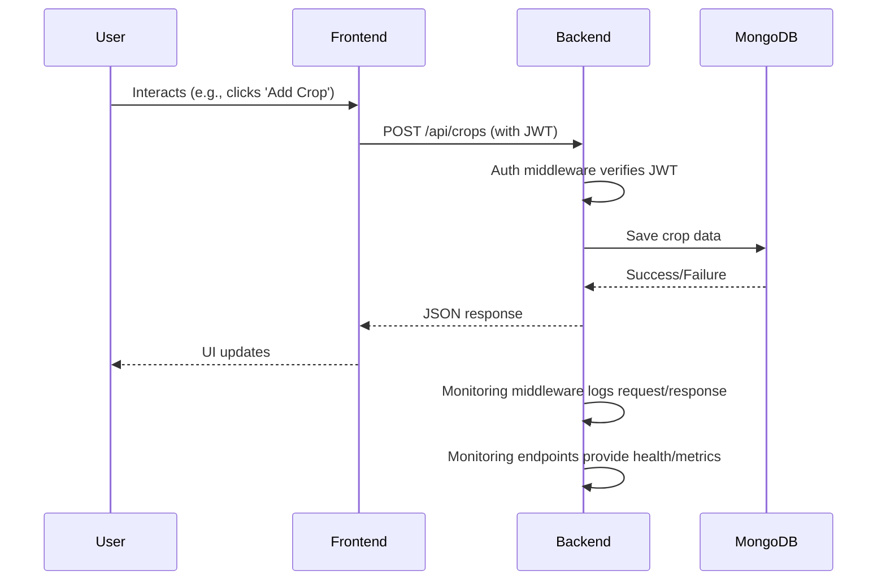

# FarmLink Architecture

FarmLink is a modern web application with a clear separation between frontend and backend, using RESTful APIs, JWT authentication, and built-in system monitoring. Below is an overview of the system architecture, data flow, and technology stack.

---

## System Overview

```
+-------------+        HTTP/REST        +-------------+        MongoDB Atlas/
|  Frontend   | <--------------------> |   Backend   | <---->   MongoDB    |
|  (React)    |                        | (Express)   |        (Database)   |
+-------------+                        +-------------+                    |
                                        |                                 |
                                        +-- Monitoring & Health Endpoints |
```

---

## Technology Stack
- **Frontend:** React, React Router, Chart.js, Tailwind CSS, Axios
- **Backend:** Node.js, Express, Mongoose, JWT, CORS, Monitoring
- **Database:** MongoDB (local or cloud)
- **Authentication:** JWT (JSON Web Tokens)
- **Monitoring:** Custom endpoints for health, metrics, and performance

---

## Data Flow
1. **User interacts with the frontend** (e.g., registers, logs in, manages crops/tasks).
2. **Frontend sends HTTP requests** to backend API endpoints (e.g., `/api/auth/login`, `/api/crops`, `/api/monitoring/health`).
3. **Backend authenticates requests** (using JWT for protected routes) and interacts with MongoDB via Mongoose models.
4. **Backend returns JSON responses** to the frontend.
5. **Frontend updates UI** based on API responses.

---

## Main Components

### Frontend
- **App.jsx**: Main entry, routing, and context providers.
- **Components**: Navbar, Dashboard, CropList, CropForm, TaskList, TaskForm, Profile, Auth forms.
- **Context**: AuthContext for authentication state and methods.

### Backend
- **server.js**: Express app setup, middleware, error handling, and route mounting.
- **Routes**: `/api/auth`, `/api/crops`, `/api/tasks`, `/api/monitoring`.
- **Models**: User, Crop, Task (Mongoose schemas).
- **Middleware**: Auth (JWT verification), Validation, Monitoring.

---

## Security
- **JWT tokens** are used for authentication and must be included in the `Authorization` header for protected endpoints.
- **CORS** is configured to allow requests only from trusted frontend origins.
- **Password hashing** is handled with bcryptjs.

---

## Deployment
- **Frontend**: Can be deployed to Vercel, Netlify, or any static hosting.
- **Backend**: Can be deployed to Render, Heroku, or any Node.js server.
- **Database**: MongoDB Atlas (cloud) or local MongoDB instance.

---

## Diagram: Request Lifecycle



---

## Data Model Highlights
- **User**: name, email, password, farmLocation, phoneNumber
- **Crop**: name, plantingDate, expectedHarvestDate, notes, status, userId, createdAt, updatedAt, daysUntilHarvest, growthProgress
- **Task**: cropId, description, dueDate, status, priority, category, estimatedDuration, notes, userId, createdAt, updatedAt, daysUntilDue, isOverdue

---

For more details, see the code and [API.md](API.md).